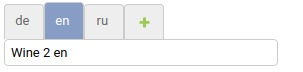

# django-tof
Django models translation on fly 🛸️

----
Этот проект был инициирован, продвигался и сопровождался winePad GmbH. Разработка полностью основана на идеях, опыте и финансировании winePad GmbH (winePad.at).

----

----
Предпосылки и цели этого проекта описаны [тут](https://github.com/mom1/django-tof/wiki/django-tof)

Приложение для перевода динамического содержимого существующих моделей Django на произвольное количество языков

  - без необходимости изменения исходных классов моделей
  - без необходимости перезапуска сервера
  - без изменения схемы использования переводимых полей
  - готов к работе сразу после установки и указании в INSTALLED_APPS
  - полностью интегрирован в админку Django.

## Установка

`pip install django-tof`

`python manage.py migrate tof`

~~~python
# settings.py
...
INSTALLED_APPS = [
...
'tof',
...
]
~~~
Не забудьте сделать при необходимости `python manage.py collectstatic`

## Использование

  1. В самом простом варианте использования django-tof позволяет хранить перевод на текущий язык.
Для этого не требуется особых настроек достаточно добавить это поле в админке в модель "Translatable fields".
В этом случае если текущий язык en то значение сохраненное в моделе будет выводится только если текущий язык en.
  1. Если нужно поддерживать некоторое количество языков и вносить их одновременно то для удобства можно воспользоваться `TofAdmin`.
Использование `class CustomModelAdmin(TofAdmin)` приведет к тому что переводимые поля (добавленные в "Translatable fields") будут иметь возможность
указать конкретный язык. При этом есть возможность некоторые поля оставить в предыдущем виде указав их в `TofAdmin` атрибут `only_current_lang = ('description', )`. 

  1. Также можно использовать инлайн формы представления переводов. Для этого в админ классе (обязательно унаследованного от "TofAdmin") указать
`inlines = (TranslationTabularInline, )` или `inlines = (TranslationStackedInline, )`
В этом случае для избежания двоякости значений переводимое поле будет скрыто классом "TofAdmin" автоматически.

## Использование программно

Ни чем не отличается от стандартного, но имеется возможность получить специфичный перевод.

~~~python
from django.utils.translation import activate

activate('en')
book = Book.objects.first()
book.title  # => Title en
book.title.de  # => Title de
~~~

## Настройка

_Значение для этих переменных можно указать в вашем settings.py_

DEFAULT_LANGUAGE: _по умолчанию_ "en" - Дефолтный язык заглушка, используется если не найдено ни каких других переводов.

FALLBACK_LANGUAGES: _по умолчанию_ `{SITE_ID: ('en', 'de', 'ru'), 'fr': ('nl', ),}` - Определяет порядок перебора языков для поиска перевода если перевода на искомом
языке нет. Ключом может быть SITE_ID, None или язык.
Порядок обработки такой, если не найден перевод на текущий/запрашиваемый язык то сначала проверяем по ключу языка если есть ищем переводы по указанным языкам если нет то берем по ключу SITE_ID.
Для примера

  - если текущий язык "fr" то порядок поиска переводов будет следующим "fr" -> "nl" -> DEFAULT_LANGUAGE -> затем если есть оригинальное значение которое было до объявления этого поля переводимым.
  - если текущий язык "en" то порядок поиска переводов будет следующим "en" -> "de" -> "ru" -> DEFAULT_LANGUAGE -> затем если есть оригинальное значение которое было до объявления этого поля переводимым.

DEFAULT_FILTER_LANGUAGE: _по умолчанию_ "current" - Указывает в каких переводах искать/фильтровать значения. может быть в следующих видах `__all__`, `current`, `['en', 'de']`, `{'en', ('en', 'de', 'ru')}`

  - `current` - если присвоено это значения то фильтрация происходит только по переводу на текущий язык. Это значение по умолчанию.
  - `__all__` - если присвоено это значения то фильтрация происходит по всем переводам.
  - `['en', 'de']` - если присвоено это значения то фильтрация происходит по переводам указанных языков.
  - `{'en', ('en', 'de', 'ru')}` - - если присвоено это значения то фильтрация происходит по переводам языков полученных по ключу текущего языка.

CHANGE_DEFAULT_MANAGER: _по умолчанию_ "True" - Изменять ли дефолтный менеджер в моделе. Если True то стандартный менеджер переносится в атрибут класса "objects_origin",
а "objects" становится менеджером унаследованным от стандартного с добавлением функционала распознающего переводимые поля и учитывающий настройки из DEFAULT_FILTER_LANGUAGE.

## Требования

  - Python (\>=3.6)
  - Django (\>=2.2)

## Как начать разработку

  1. Форкнуть этот проект
  2. Склонировать репозиторий
  3. Создать свою ветку
  4. **Перейти в директорию `example_project`**
  5. Вы можете использовать [pyenv](https://github.com/pyenv/pyenv) для выбора версии python `pyenv local 3.8.0`
  6. Мы используем [poetry](https://poetry.eustace.io/docs/#installation)
  7. Запустить: `poetry env use python` для использования вашей версии python.
  8. Запустить: `poetry install` для установки всех зависимостей.
  9. Запустить: `poetry shell` для активации виртуального окружения.
  10. Запустить: `python manage.py runserver` для запуска сервера разработчика
